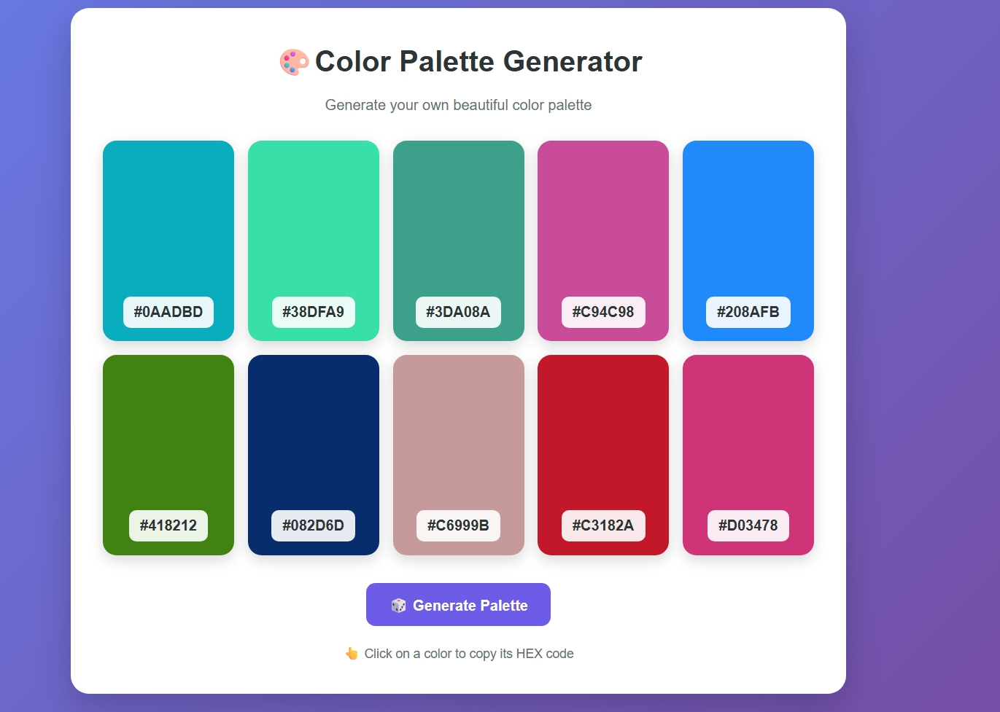

# 🎨 Color Palette Generator

A simple and interactive Color Palette Generator built using HTML, CSS and JavaScript.

## 🚀 Features

- 🎨 Generate random color palettes
- 🔢 Generate HEX color codes
- 📋 Copy HEX color code
- 🔄 Generate new palette
- 📱 Responsive design
- ✨ Interactive UI

## 🛠️ Technologies Used

- HTML5
- CSS3
- JavaScript
- DOM Manipulation
- Clipboard API

## 📸 Screenshot

## 🌐 Live Demo

https://yamunakumari890.github.io/color-palette-generator/

## 🧠 What I Learned

- DOM Manipulation
- JavaScript Functions
- Arrays and Loops
- Math.random()
- HEX Color Generation
- Event Listeners
- Clipboard API
- Git & GitHub

## 👩‍💻 Author

Yamuna Kumari